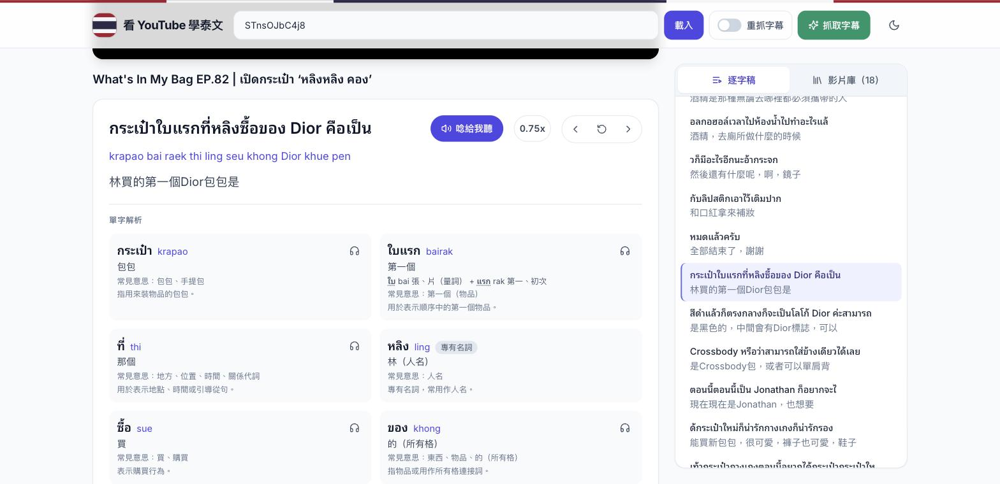
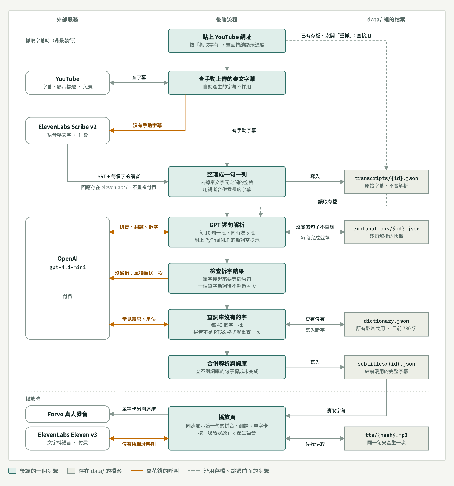

**繁體中文** | [English](README.en.md)

# 看 YouTube 學泰文

貼上一部泰文 YouTube 影片，系統會取得字幕，請 GPT 逐句產生拼音（RTGS）、繁體中文翻譯和單字解析。播放影片時，畫面會同步顯示目前這一句的內容。




## 功能

- **同步字幕**：播放時顯示目前這句的泰文、拼音、翻譯和單字解析。
- **單字卡**：整句拆成一個個字典詞條，標出語氣詞、量詞、專有名詞和固定說法，複合詞會列出組成；每張卡片可以另開 [Forvo](https://forvo.com/) 聽真人發音。
- **逐字稿**：列出整部影片的每一句，點任一句跳到該時間；也可以用「上一句／重播／下一句」。
- **AI 朗讀**：按「唸給我聽」，用 ElevenLabs 的語音把目前這句唸出來。
- **影片庫**：列出所有已經有字幕的影片，可用標題搜尋，並標示解析是否完整。
- **抓取字幕**：貼上 YouTube 網址或影片 ID 就能加入新影片，畫面會顯示進度。
- **深色模式**。

## 事前準備

在專案根目錄建立 `.env`，放兩把 API 金鑰：

```
OPENAI_API_KEY=你的 OpenAI 金鑰
ELEVENLABS_API_KEY=你的 ElevenLabs 金鑰
```

- `OPENAI_API_KEY`：產生解析時使用（模型是 `gpt-4.1-mini`），帳號需要有額度。
- `ELEVENLABS_API_KEY`：兩個地方會用到。影片沒有手動上傳的泰文字幕時，用來把聲音轉成文字（金鑰需要 Speech to Text 權限）；按「唸給我聽」時，用來產生語音（金鑰需要 Text to Speech 權限）。

朗讀用的聲音可以在 `.env` 加上 `ELEVENLABS_VOICE_ID=聲音 ID` 來更換。

解析時預設會先用 [PyThaiNLP](https://pythainlp.org/) 做機器斷詞，把結果附給 GPT 當參考。想關掉可以在 `.env` 加上 `SEGMENT_HINT=off`（GPT 回來的結果仍然會用機器斷詞檢查）。

只看已經抓好的影片不會用到任何金鑰。

## 啟動方式

### 方法一：Docker（只想把它跑起來）

需要先安裝並開啟 Docker Desktop。

```bash
docker compose up --build
```

- 前端：<http://localhost:5173>
- 後端：<http://localhost:8000>

埠被佔用時可以換：

```bash
API_PORT=8001 WEB_PORT=5174 docker compose up --build
```

Docker 版的前端是打包後的靜態檔，改了程式碼要重新執行上面的指令才會生效。

### 方法二：本機開發（改程式碼會即時更新）

需要 Python 3.10 和 Node.js 22，並開兩個終端機。

**後端**（在專案根目錄執行，不是 `backend/` 裡面）：

```bash
pip install -r requirements.txt
uvicorn backend.api_server:app --reload
```

**前端**：

```bash
cd frontend
npm install
npm run dev
```

然後打開 <http://localhost:5173>。兩個都要開著，後端沒開的話前端連影片庫都讀不到。

後端如果不在 `http://127.0.0.1:8000`，在 `frontend/.env` 設定 `VITE_API_URL=後端網址`。

## 使用方式

1. **看已有的影片**：在影片庫點任一部影片。
2. **加入新影片**：在上方貼上 YouTube 網址或影片 ID，按「抓取字幕」。完成後會自動載入。
3. **補上缺少的解析**：影片庫裡標示「解析 19 / 280」的影片，載入後再按一次「抓取字幕」，只會處理還沒有解析的句子。
4. **「重抓字幕」開關**：預設關閉，抓取時沿用存過的字幕；打開後會重新向 YouTube 取得字幕再跑解析。

一部 500 句左右的影片大約需要 5 分鐘。中途失敗（例如額度用完）時，已完成的部分會保留，再按一次會從中斷處繼續。

## 專案結構

```
.
├── backend/                 後端（FastAPI）
│   ├── api_server.py        進入點，只放路由
│   ├── jobs.py              抓取任務的流程與進度
│   ├── youtube.py           向 YouTube 抓字幕、查影片標題
│   ├── elevenlabs_api.py    ElevenLabs 語音轉文字與 SRT 解析
│   ├── gpt_teacher.py       送給 OpenAI：逐句解析、替詞庫查沒看過的字
│   ├── segmenter.py         用 PyThaiNLP 做機器斷詞
│   ├── analysis_check.py    檢查單字有沒有涵蓋整句、有沒有拆開
│   ├── dictionary.py        詞庫的讀寫與合併
│   ├── rtgs.py              檢查詞庫的拼音是不是 RTGS 的格式
│   ├── tts.py               用 ElevenLabs 把一句字幕唸出來
│   └── storage.py           所有資料檔的位置與讀寫
├── frontend/                前端（React + Vite + Tailwind）
│   ├── src/VideoSubtitleApp.jsx   整個畫面
│   └── Dockerfile
├── data/                    所有資料（見下方）
├── Dockerfile               後端的映像檔
├── docker-compose.yml       一次啟動前後端
├── scripts/                 對照實驗、修復詞庫拼音用的腳本
├── tests/                   後端的測試（pytest）
├── requirements.txt         後端的 Python 套件
├── requirements-dev.txt     開發用的套件（測試）
└── .env                     API 金鑰（自己建立）
```

### `data/` 裡的資料

每部影片以它的 YouTube 影片 ID 當檔名。

| 位置 | 內容 |
|---|---|
| `subtitles/{id}.json` | 最終給前端用的字幕，每一句含時間與解析 |
| `transcripts/{id}.json` | 抓回來的原始字幕，不含解析 |
| `explanations/{id}.json` | GPT 逐句解析的快取（整句的拼音、翻譯、每個字在這句的意思） |
| `dictionary.json` | 詞庫：每個單字的拼音、組成、常見意思與用法，所有影片共用 |
| `elevenlabs/{id}.json` | ElevenLabs 的原始轉錄回應 |
| `tts/{hash}.mp3` | 朗讀語音的快取，同一句只會產生一次 |
| `video_titles.json` | 影片標題的快取 |

`subtitles/` 是成品，其餘都是為了避免重複連線或重複付費而保留的中間結果。

這個 repo 只附兩部影片的成品（`subtitles/1Sk8kiYfZGg.json`、`subtitles/h1r8CxHJnnc.json`）當範例，其餘資料不在版本控制裡，抓取影片時會自動產生。

## 抓取一部影片時發生什麼事



橘色的線是會花錢的呼叫，虛線是沿用存檔、跳過前面步驟的路徑。完整的說明（每一步對應的程式檔、零長度字幕的合併規則、各項快取）在 [`docs/workflow.html`](docs/workflow.html)，下載後用瀏覽器打開。

1. **取得字幕**
   - 本機已經存過這部影片的字幕就直接使用。
   - 否則向 YouTube 要手動上傳的泰文字幕。
   - 影片沒有手動泰文字幕時，改用 ElevenLabs 把聲音轉成文字。
2. **逐句解析**：字幕每 10 句切成一段，同時送 5 段給 OpenAI，取得整句的拼音、翻譯，以及拆成單字後每個字在這句的意思。每完成一段就存進快取。
3. **檢查**：用機器斷詞確認單字涵蓋整句，而且沒有把片語當成一個字。沒通過的句子會單獨重送一次。
4. **查詞**：詞庫裡沒有的字每 40 個一批送給 OpenAI，取得拼音、組成、常見意思與用法，寫進詞庫。看過的字之後每部影片都直接沿用，所以影片越多，這一步越快。
5. **合併存檔**：把逐句解析和詞庫合併，寫入 `data/subtitles/`。

快取以「句子編號加上泰文內容」為準：內容沒變的句子不會重新送出，所以重跑只會處理缺少或改變的部分。

解析的格式有版本號。格式更新後，舊影片在影片庫會顯示為解析未完成，對它按一次「抓取字幕」就會用新格式重跑；重跑之前舊的解析照常顯示。

## 測試

```bash
pip install -r requirements-dev.txt
python -m pytest
```

測試不會連到 OpenAI。

## 後端 API

| 方法 | 路徑 | 用途 |
|---|---|---|
| `GET` | `/videos` | 列出有字幕的影片（標題、句數、已解析句數） |
| `GET` | `/subtitles/{video_id}` | 取得一部影片的字幕與解析 |
| `POST` | `/analyze` | 開始抓取，內容為 `{"video_id": "...", "refetch_transcript": false}` |
| `GET` | `/status/{video_id}` | 查詢抓取進度 |
| `GET` | `/tts/{video_id}/{line_id}` | 把某一句字幕唸出來，回傳 mp3 |

後端啟動後，<http://localhost:8000/docs> 有可以直接操作的 API 文件。

## 已知限制

- **向 YouTube 抓字幕有時會失敗**（出現 `ParseError` 或 500 錯誤）。已經存過字幕的影片不受影響；新影片遇到時可以稍後再試。
- **拼音偶爾不標準**，這是模型本身的準確度問題。
- **多行字幕的拼音換行不一定和原文對齊**，內容都在，只是不會剛好一行對一行。
- **抓取進度只存在記憶體**：後端重啟後進行中的任務會消失，再按一次「抓取字幕」會從快取接續。
- **想調整抓取速度**：改 `backend/gpt_teacher.py` 的 `MAX_WORKERS`（同時送出的段數）。
- **單字卡和整句的拼音偶爾寫法不同**：單字卡的拼音來自詞庫，整句的拼音是 GPT 另外產生的。
- **同形異音字共用一筆詞庫資料**：詞庫以泰文拼法區分單字，拼法相同但讀音不同的字不會分開。
